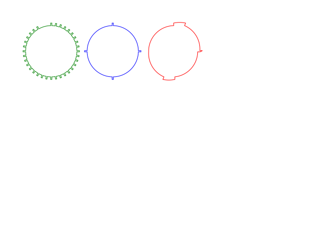
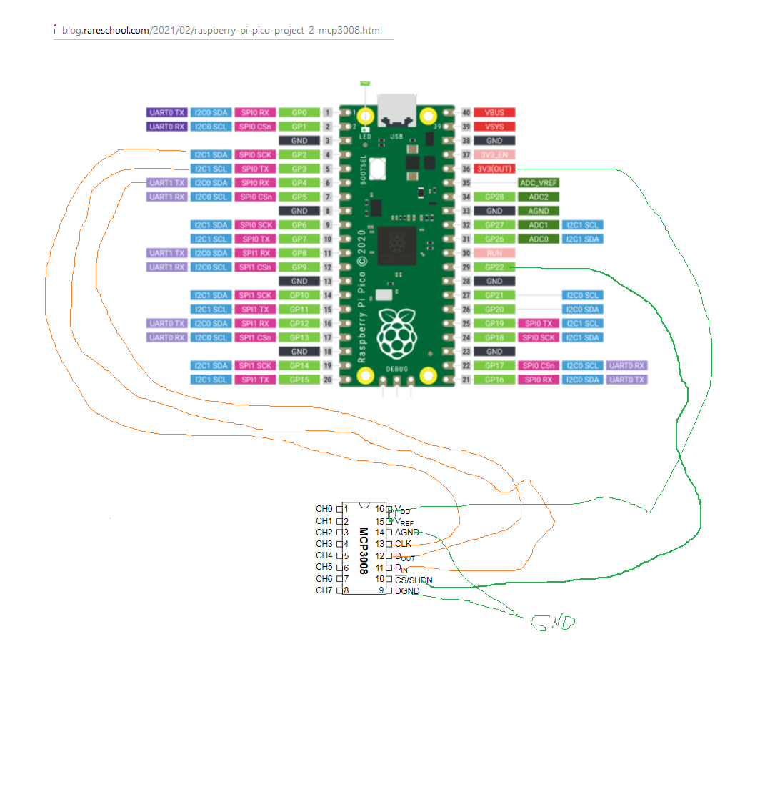

20210313:

begriffe:

Vx:
alle poties als 32 stellungs poties zu verstehen

V10:
kurbelwelle dreht mit 0,200-20000 U/min 34+2 zacken, duty 25%
nockenwelle 3+4 synchron zu kurbelwelle mit verschiebung
zuendsignal synchron zu kurbelwelle mit verschiebung
zuenaussetzer 1,2,3,4 einzeln komplet aus oder an
wegfahrsperre
zwei lambda sonden signale (=PWM) 0,1 Hz, 1Hz, 10 Hz + duty cyle  = 4 poties

loesungsansaetze:
a) lambda via pwm library
b) andere signale via PIO mit sync oder PIO aus speicher

V11:
zuendaussetzer nicht nur an oder aus sondern aussetzer regelbar von 1/1000 aussetzer bis 1000/1000 aussetzer
frage: per zufall (schwierig?)

V12:
kurbelwelle dreht nicht mit konstanter geschwindigkeit innerhalb einer drehung

###################################

https://www.heise.de/developer/artikel/Ein-Picobello-Microcontroller-Raspberry-Pi-Pico-Board-5045274.html
https://www.cnx-software.com/2021/01/27/a-closer-look-at-raspberry-pi-rp2040-programmable-ios-pio/
https://tutorials-raspberrypi.de/raspberry-pi-pico-mikrocontroller-programmieren/

https://hackspace.raspberrypi.org/articles/what-is-programmable-i-o-on-raspberry-pi-pico
https://www.seeedstudio.com/blog/2021/01/25/programmable-io-with-raspberry-pi-pico/
https://learn.adafruit.com/getting-started-with-raspberry-pi-pico-circuitpython
https://www.cnx-software.com/2021/01/27/a-closer-look-at-raspberry-pi-rp2040-programmable-ios-pio/

MCP3008-I/P

https://www.adafruit.com/product/931
-> nicht verfuegbar
https://shop.pimoroni.com/products/1-12-oled-breakout?variant=29421050757203
-> 14 EUR
https://www.adafruit.com/product/1463
-> 10 EUR
BME280
MPU9250 board
MPU6050 board
-> adafruit 3886-> 7 EUR

Raspberry Pi Pico - USB HID Auto Clicker with Circuit Python

5x2 kabel breadboard 
5x2 femaleXfemale

blues teile breadboard book

20210307:
https://cdn-shop.adafruit.com/datasheets/MCP3008.pdf
https://blog.rareschool.com/2021/02/raspberry-pi-pico-project-2-mcp3008.html

todos:
implement wegfahrsperre
stop and instanciate pio maschine with frequency from poti
research on sync pios, read from memory
document requirements V10+V11+V12
order mcp3008, 10kOhm poties 20, jumper, adapter osci, level shifter ic

